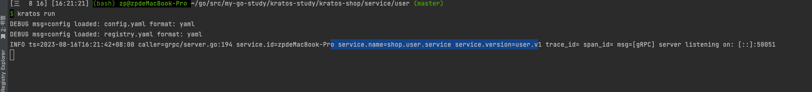

# 环境准备

- https://learnku.com/articles/65095

## 数据

## consul

## jaeger
- 查看追踪   http://srv.in:16686/search


# 启动服务


## 1. user 服务

- 这里就注册了了服务




- 服务的注册


- 服务的发现(使用)


```bash 
cd service/user && kratos run 
```

## 2. shop
```bash 
cd shop && kratos run 
```


